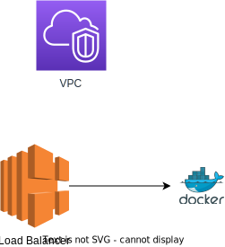

# Infrastructure as code Hackathon

## Overview

We're going to create a simple architecture in AWS.
The goal is to deploy our own server to AWS, using a Load balancer as the gateway and then setup a simple network.

## Architecture



## Lessons

- [Lesson 1](./lessons/lesson-1.md)
- [Lesson 2](./lessons/lesson-2.md)

## Prerequisites

- Node.js
- AWS CLI
- CDK CLI

### Installing AWS CLi

#### MacOS
```bash
brew install awscli
```

#### Windows
```powershell
winget install Amazon.AWSCLI
```

### Node.js

#### MacOS

```bash
brew install nvm
nvm install --lts
```

#### Windows

Go to https://github.com/coreybutler/nvm-windows/releases and download the latest version.

```
nvm install 20
```

## CDK CLI

```bash
npm install -g aws-cdk
```

## Getting started

### Setting up your project

To initialize your project, run the following command:

```bash
cdk init app --language typescript
```

This will setup a very basic CDK project that we can further expand on.

### Logging into AWS

```bash
aws configure sso
```

Go through the wizard, when asked for the following, provide the following:

- SSO Start URL: https://bybrick-tech.awsapps.com/start
- SSO region: eu-north-1
- Role: AdministratorAccess
- CLI default client region: eu-north-1
- CLI profile name: hackathon

If we've not specified a value, you can just use the default (ENTER).

If you ever get get an error saying you're not authenticated, you can run the following command to re-authenticate:

```bash
aws sso login
```
